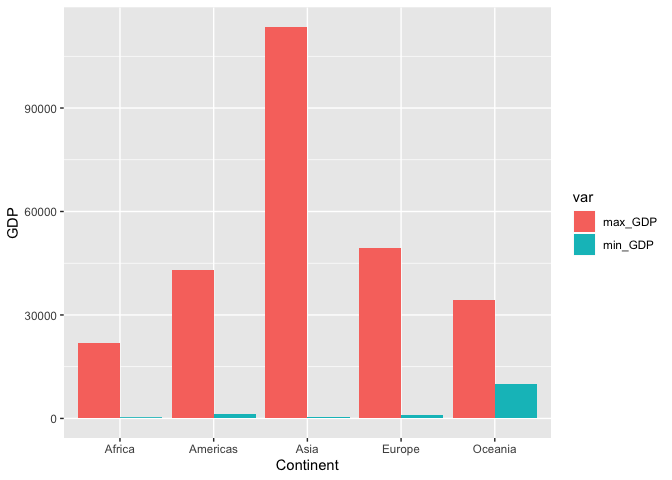
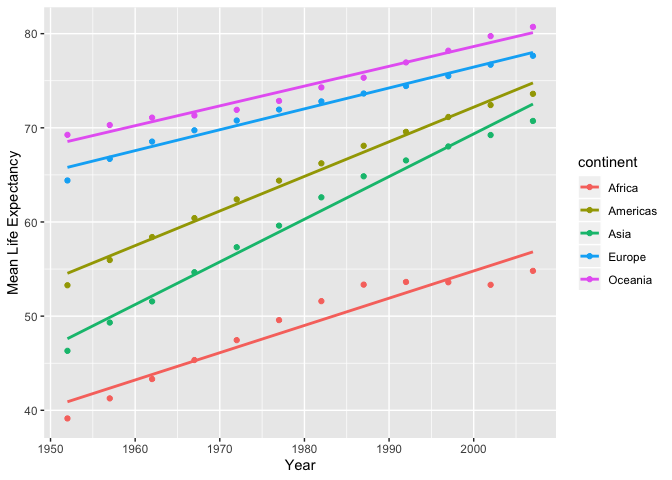
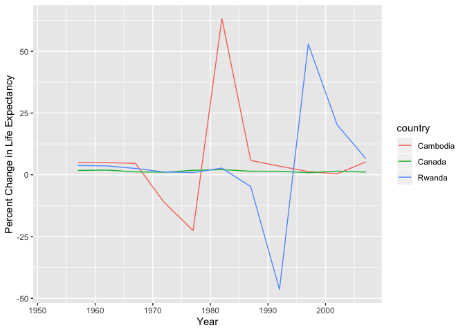

```r
library(gapminder)
library(tidyverse)
```

```
## ── Attaching packages ───────────────────────────────────────────────────────────────────────────────────── tidyverse 1.2.1 ──
```

```
## ✔ ggplot2 3.2.1     ✔ purrr   0.3.2
## ✔ tibble  2.1.3     ✔ dplyr   0.8.3
## ✔ tidyr   1.0.0     ✔ stringr 1.4.0
## ✔ readr   1.3.1     ✔ forcats 0.4.0
```

```
## ── Conflicts ──────────────────────────────────────────────────────────────────────────────────────── tidyverse_conflicts() ──
## ✖ dplyr::filter() masks stats::filter()
## ✖ dplyr::lag()    masks stats::lag()
```

```r
library(dplyr)
library(DT)
```


# For each task chosen we need to produce: 
# A tibble, a graph and an explanation of data

# TASK 2
## Get the maximum and minimum of GDP per capita for all continents.


```r
task2 = gapminder %>% 
  group_by(continent) %>% 
  summarize(min_GDP = min(gdpPercap),
            max_GDP = max(gdpPercap))
  as_tibble(task2)
```

```
## # A tibble: 5 x 3
##   continent min_GDP max_GDP
##   <fct>       <dbl>   <dbl>
## 1 Africa       241.  21951.
## 2 Americas    1202.  42952.
## 3 Asia         331  113523.
## 4 Europe       974.  49357.
## 5 Oceania    10040.  34435.
```


```r
task2 %>%
    gather(var, GDP, -continent)%>%
    ggplot(aes(x = continent, y = GDP, fill = var)) +
    geom_col(position = position_dodge()) +
    xlab('Continent')+
    ylab('GDP')
```

<!-- -->

#### From 1952 - 2007, Asia has the largest GDP and Afria has the smallest GDP. The difference between max and min GDPs in Asia is significantly larges for Asia than for all other continents.

# TASK 5
## How is life expectancy changing over time on different continents?


```r
task5 = gapminder %>% 
  group_by(year, continent) %>% 
  summarize(meanlife = mean(lifeExp)) %>% 
  arrange(continent)
  as_tibble(task5)
```

```
## # A tibble: 60 x 3
##     year continent meanlife
##    <int> <fct>        <dbl>
##  1  1952 Africa        39.1
##  2  1957 Africa        41.3
##  3  1962 Africa        43.3
##  4  1967 Africa        45.3
##  5  1972 Africa        47.5
##  6  1977 Africa        49.6
##  7  1982 Africa        51.6
##  8  1987 Africa        53.3
##  9  1992 Africa        53.6
## 10  1997 Africa        53.6
## # … with 50 more rows
```


```r
  ggplot(task5, aes(year, meanlife, colour = continent)) +
    geom_point() +
    geom_smooth(method = lm, se = FALSE) +
    xlab('Year') +
    ylab('Mean Life Expectancy')
```

<!-- -->

### There has been a overall increase in life expectancy in all continents. Asia has had the largest increase in mean life expectancy from 1952 - 2007. Oceania and Europe have experienced a similar rise in life expectancy. Oceania has the highest life expectancy out of all continents. 

# TASK 6
## Looking at population recovery in countries post genocide: Rwanda, Cambodia compared one country without.


```r
task6 = gapminder %>% 
  filter(country == 'Rwanda' | country == 'Cambodia' | country == 'Canada') %>% 
  group_by(country) %>% 
  arrange(country, year) %>% 
  mutate(pct_change = ((lifeExp/lag(lifeExp) - 1) * 100))
  as_tibble(task6)
```

```
## # A tibble: 36 x 7
##    country  continent  year lifeExp      pop gdpPercap pct_change
##    <fct>    <fct>     <int>   <dbl>    <int>     <dbl>      <dbl>
##  1 Cambodia Asia       1952    39.4  4693836      368.      NA   
##  2 Cambodia Asia       1957    41.4  5322536      434.       4.94
##  3 Cambodia Asia       1962    43.4  6083619      497.       4.95
##  4 Cambodia Asia       1967    45.4  6960067      523.       4.61
##  5 Cambodia Asia       1972    40.3  7450606      422.     -11.2 
##  6 Cambodia Asia       1977    31.2  6978607      525.     -22.6 
##  7 Cambodia Asia       1982    51.0  7272485      624.      63.2 
##  8 Cambodia Asia       1987    53.9  8371791      684.       5.80
##  9 Cambodia Asia       1992    55.8 10150094      682.       3.50
## 10 Cambodia Asia       1997    56.5 11782962      734.       1.31
## # … with 26 more rows
```

```r
    ggplot(task6, aes(year, pct_change, colour = country)) +
    geom_line() +
    xlab('Year') +
    ylab('Percent Change in Life Expectancy')
```

```
## Warning: Removed 3 rows containing missing values (geom_path).
```

<!-- -->
### Population recovery post genocide displays the same trend in both Cambodia and Rwanda. Canada shows that the percent change in life expectancy in countries that have not experienced genocide is flat. 
