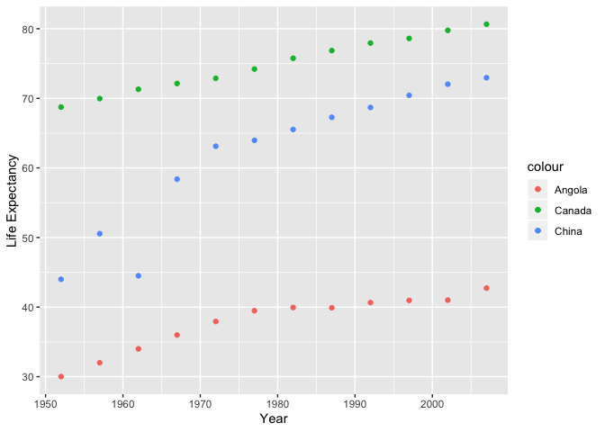

```r
library(tidyverse)
library(ggplot2)
library(gapminder)
library(dplyr)
```

<!---The following chunk allows errors when knitting--->


# Tasks :
##### 1. Putting data in wider format;
##### 2. Producing a plot of the wide data; (10%)
##### 3. Re-lengthening the wider data. (10%)
 

## Exercise 1: 
#### Univariate Option 1

#### Make a tibble with one row per year, and columns for life expectancy for two or more countries.

```r
(exer1 = gapminder %>% 
  filter(country == "Canada" | country == "China" | country == "Angola") %>% 
     pivot_wider(id_cols = c(year), 
              names_from = country, 
              values_from = lifeExp)) %>% 
  DT :: datatable(exer1)
```

<!--html_preserve--><div id="htmlwidget-2cabadf70b0b4a94cd32" style="width:100%;height:auto;" class="datatables html-widget"></div>
<script type="application/json" data-for="htmlwidget-2cabadf70b0b4a94cd32">{"x":{"filter":"none","data":[["1","2","3","4","5","6","7","8","9","10","11","12"],[1952,1957,1962,1967,1972,1977,1982,1987,1992,1997,2002,2007],[30.015,31.999,34,35.985,37.928,39.483,39.942,39.906,40.647,40.963,41.003,42.731],[68.75,69.96,71.3,72.13,72.88,74.21,75.76,76.86,77.95,78.61,79.77,80.653],[44,50.54896,44.50136,58.38112,63.11888,63.96736,65.525,67.274,68.69,70.426,72.028,72.961]],"container":"<table class=\"display\">\n  <thead>\n    <tr>\n      <th> <\/th>\n      <th>year<\/th>\n      <th>Angola<\/th>\n      <th>Canada<\/th>\n      <th>China<\/th>\n    <\/tr>\n  <\/thead>\n<\/table>","options":{"year":[1952,1957,1962,1967,1972,1977,1982,1987,1992,1997,2002,2007],"Angola":[30.015,31.999,34,35.985,37.928,39.483,39.942,39.906,40.647,40.963,41.003,42.731],"Canada":[68.75,69.96,71.3,72.13,72.88,74.21,75.76,76.86,77.95,78.61,79.77,80.653],"China":[44,50.54896,44.50136,58.38112,63.11888,63.96736,65.525,67.274,68.69,70.426,72.028,72.961],"columnDefs":[{"className":"dt-right","targets":[1,2,3,4]},{"orderable":false,"targets":0}],"order":[],"autoWidth":false,"orderClasses":false}},"evals":[],"jsHooks":[]}</script><!--/html_preserve-->

#### Take advantage of this new data shape to scatterplot life expectancy for one country against that of another.


```r
exer1 %>% 
  ggplot(aes(year, Angola, colour = "Angola")) +
    geom_point( ) +
    geom_point(aes(year, Canada, colour = "Canada"))+
    geom_point(aes(year, China, colour = "China")) +
    xlab('Year') +
    ylab('Life Expectancy')
```

<!-- -->

#### Re-lengthen the data.


```r
exer1 %>%  
  pivot_longer(cols = Angola:China, 
               names_to  = "Country", 
               values_to = "Life Expectancy") %>% 
DT:: datatable(exer1)
```

<!--html_preserve--><div id="htmlwidget-0393bc868cfaf84d343b" style="width:100%;height:auto;" class="datatables html-widget"></div>
<script type="application/json" data-for="htmlwidget-0393bc868cfaf84d343b">{"x":{"filter":"none","data":[["1","2","3","4","5","6","7","8","9","10","11","12","13","14","15","16","17","18","19","20","21","22","23","24","25","26","27","28","29","30","31","32","33","34","35","36"],[1952,1952,1952,1957,1957,1957,1962,1962,1962,1967,1967,1967,1972,1972,1972,1977,1977,1977,1982,1982,1982,1987,1987,1987,1992,1992,1992,1997,1997,1997,2002,2002,2002,2007,2007,2007],["Angola","Canada","China","Angola","Canada","China","Angola","Canada","China","Angola","Canada","China","Angola","Canada","China","Angola","Canada","China","Angola","Canada","China","Angola","Canada","China","Angola","Canada","China","Angola","Canada","China","Angola","Canada","China","Angola","Canada","China"],[30.015,68.75,44,31.999,69.96,50.54896,34,71.3,44.50136,35.985,72.13,58.38112,37.928,72.88,63.11888,39.483,74.21,63.96736,39.942,75.76,65.525,39.906,76.86,67.274,40.647,77.95,68.69,40.963,78.61,70.426,41.003,79.77,72.028,42.731,80.653,72.961]],"container":"<table class=\"display\">\n  <thead>\n    <tr>\n      <th> <\/th>\n      <th>year<\/th>\n      <th>Country<\/th>\n      <th>Life Expectancy<\/th>\n    <\/tr>\n  <\/thead>\n<\/table>","options":{"year":[1952,1957,1962,1967,1972,1977,1982,1987,1992,1997,2002,2007],"Angola":[30.015,31.999,34,35.985,37.928,39.483,39.942,39.906,40.647,40.963,41.003,42.731],"Canada":[68.75,69.96,71.3,72.13,72.88,74.21,75.76,76.86,77.95,78.61,79.77,80.653],"China":[44,50.54896,44.50136,58.38112,63.11888,63.96736,65.525,67.274,68.69,70.426,72.028,72.961],"columnDefs":[{"className":"dt-right","targets":[1,3]},{"orderable":false,"targets":0}],"order":[],"autoWidth":false,"orderClasses":false}},"evals":[],"jsHooks":[]}</script><!--/html_preserve-->

#Exercise 2: Multivariate Data Reshaping

### Make a tibble with one row per year, and columns for life expectancy and GDP per capita (or two other numeric variables) for two or more countries

#### Putting data in wider format;

```r
(exer2 = gapminder %>% 
  filter(country == 'Canada' | country == 'China' | country == 'Senegal') %>% 
  pivot_wider(id_cols = c(year),
              names_from = c(country),
              names_sep = "_",
              values_from = c(lifeExp,gdpPercap))) %>% 
  DT :: datatable(exer2)
```

<!--html_preserve--><div id="htmlwidget-7bbbdc5a669ccf12ed04" style="width:100%;height:auto;" class="datatables html-widget"></div>
<script type="application/json" data-for="htmlwidget-7bbbdc5a669ccf12ed04">{"x":{"filter":"none","data":[["1","2","3","4","5","6","7","8","9","10","11","12"],[1952,1957,1962,1967,1972,1977,1982,1987,1992,1997,2002,2007],[68.75,69.96,71.3,72.13,72.88,74.21,75.76,76.86,77.95,78.61,79.77,80.653],[44,50.54896,44.50136,58.38112,63.11888,63.96736,65.525,67.274,68.69,70.426,72.028,72.961],[37.278,39.329,41.454,43.563,45.815,48.879,52.379,55.769,58.196,60.187,61.6,63.062],[11367.16112,12489.95006,13462.48555,16076.58803,18970.57086,22090.88306,22898.79214,26626.51503,26342.88426,28954.92589,33328.96507,36319.23501],[400.448611,575.9870009,487.6740183,612.7056934,676.9000921,741.2374699,962.4213805,1378.904018,1655.784158,2289.234136,3119.280896,4959.114854],[1450.356983,1567.653006,1654.988723,1612.404632,1597.712056,1561.769116,1518.479984,1441.72072,1367.899369,1392.368347,1519.635262,1712.472136]],"container":"<table class=\"display\">\n  <thead>\n    <tr>\n      <th> <\/th>\n      <th>year<\/th>\n      <th>lifeExp_Canada<\/th>\n      <th>lifeExp_China<\/th>\n      <th>lifeExp_Senegal<\/th>\n      <th>gdpPercap_Canada<\/th>\n      <th>gdpPercap_China<\/th>\n      <th>gdpPercap_Senegal<\/th>\n    <\/tr>\n  <\/thead>\n<\/table>","options":{"year":[1952,1957,1962,1967,1972,1977,1982,1987,1992,1997,2002,2007],"lifeExp_Canada":[68.75,69.96,71.3,72.13,72.88,74.21,75.76,76.86,77.95,78.61,79.77,80.653],"lifeExp_China":[44,50.54896,44.50136,58.38112,63.11888,63.96736,65.525,67.274,68.69,70.426,72.028,72.961],"lifeExp_Senegal":[37.278,39.329,41.454,43.563,45.815,48.879,52.379,55.769,58.196,60.187,61.6,63.062],"gdpPercap_Canada":[11367.16112,12489.95006,13462.48555,16076.58803,18970.57086,22090.88306,22898.79214,26626.51503,26342.88426,28954.92589,33328.96507,36319.23501],"gdpPercap_China":[400.448611,575.9870009,487.6740183,612.7056934,676.9000921,741.2374699,962.4213805,1378.904018,1655.784158,2289.234136,3119.280896,4959.114854],"gdpPercap_Senegal":[1450.356983,1567.653006,1654.988723,1612.404632,1597.712056,1561.769116,1518.479984,1441.72072,1367.899369,1392.368347,1519.635262,1712.472136],"columnDefs":[{"className":"dt-right","targets":[1,2,3,4,5,6,7]},{"orderable":false,"targets":0}],"order":[],"autoWidth":false,"orderClasses":false}},"evals":[],"jsHooks":[]}</script><!--/html_preserve-->

#### Re-lengthening the data


```r
exer2 %>% 
 pivot_longer(cols      = -year, 
               names_to  = c(".value","Country"),
               names_sep = "_") %>% 
  DT::datatable(exer2)
```

<!--html_preserve--><div id="htmlwidget-5dbd955f2dd48a9ddad0" style="width:100%;height:auto;" class="datatables html-widget"></div>
<script type="application/json" data-for="htmlwidget-5dbd955f2dd48a9ddad0">{"x":{"filter":"none","data":[["1","2","3","4","5","6","7","8","9","10","11","12","13","14","15","16","17","18","19","20","21","22","23","24","25","26","27","28","29","30","31","32","33","34","35","36"],[1952,1952,1952,1957,1957,1957,1962,1962,1962,1967,1967,1967,1972,1972,1972,1977,1977,1977,1982,1982,1982,1987,1987,1987,1992,1992,1992,1997,1997,1997,2002,2002,2002,2007,2007,2007],["Canada","China","Senegal","Canada","China","Senegal","Canada","China","Senegal","Canada","China","Senegal","Canada","China","Senegal","Canada","China","Senegal","Canada","China","Senegal","Canada","China","Senegal","Canada","China","Senegal","Canada","China","Senegal","Canada","China","Senegal","Canada","China","Senegal"],[68.75,44,37.278,69.96,50.54896,39.329,71.3,44.50136,41.454,72.13,58.38112,43.563,72.88,63.11888,45.815,74.21,63.96736,48.879,75.76,65.525,52.379,76.86,67.274,55.769,77.95,68.69,58.196,78.61,70.426,60.187,79.77,72.028,61.6,80.653,72.961,63.062],[11367.16112,400.448611,1450.356983,12489.95006,575.9870009,1567.653006,13462.48555,487.6740183,1654.988723,16076.58803,612.7056934,1612.404632,18970.57086,676.9000921,1597.712056,22090.88306,741.2374699,1561.769116,22898.79214,962.4213805,1518.479984,26626.51503,1378.904018,1441.72072,26342.88426,1655.784158,1367.899369,28954.92589,2289.234136,1392.368347,33328.96507,3119.280896,1519.635262,36319.23501,4959.114854,1712.472136]],"container":"<table class=\"display\">\n  <thead>\n    <tr>\n      <th> <\/th>\n      <th>year<\/th>\n      <th>Country<\/th>\n      <th>lifeExp<\/th>\n      <th>gdpPercap<\/th>\n    <\/tr>\n  <\/thead>\n<\/table>","options":{"year":[1952,1957,1962,1967,1972,1977,1982,1987,1992,1997,2002,2007],"lifeExp_Canada":[68.75,69.96,71.3,72.13,72.88,74.21,75.76,76.86,77.95,78.61,79.77,80.653],"lifeExp_China":[44,50.54896,44.50136,58.38112,63.11888,63.96736,65.525,67.274,68.69,70.426,72.028,72.961],"lifeExp_Senegal":[37.278,39.329,41.454,43.563,45.815,48.879,52.379,55.769,58.196,60.187,61.6,63.062],"gdpPercap_Canada":[11367.16112,12489.95006,13462.48555,16076.58803,18970.57086,22090.88306,22898.79214,26626.51503,26342.88426,28954.92589,33328.96507,36319.23501],"gdpPercap_China":[400.448611,575.9870009,487.6740183,612.7056934,676.9000921,741.2374699,962.4213805,1378.904018,1655.784158,2289.234136,3119.280896,4959.114854],"gdpPercap_Senegal":[1450.356983,1567.653006,1654.988723,1612.404632,1597.712056,1561.769116,1518.479984,1441.72072,1367.899369,1392.368347,1519.635262,1712.472136],"columnDefs":[{"className":"dt-right","targets":[1,3,4]},{"orderable":false,"targets":0}],"order":[],"autoWidth":false,"orderClasses":false}},"evals":[],"jsHooks":[]}</script><!--/html_preserve-->

# Exercise 3: Table Joins 

### Copy and Paste the following: 
guest <- read_csv("https://raw.githubusercontent.com/STAT545-UBC/Classroom/master/data/wedding/attend.csv")
email <- read_csv("https://raw.githubusercontent.com/STAT545-UBC/Classroom/master/data/wedding/emails.csv")


```r
guest <- read_csv("https://raw.githubusercontent.com/STAT545-UBC/Classroom/master/data/wedding/attend.csv")
```

```
## Parsed with column specification:
## cols(
##   party = col_double(),
##   name = col_character(),
##   meal_wedding = col_character(),
##   meal_brunch = col_character(),
##   attendance_wedding = col_character(),
##   attendance_brunch = col_character(),
##   attendance_golf = col_character()
## )
```

```r
email <- read_csv("https://raw.githubusercontent.com/STAT545-UBC/Classroom/master/data/wedding/emails.csv")
```

```
## Parsed with column specification:
## cols(
##   guest = col_character(),
##   email = col_character()
## )
```


## Exercise 3.1: For each guest in the guestlist (guest tibble), add a column for email address, which can be found in the email tibble.


```r
(new_email = email %>%
   separate_rows(guest, sep = ", ") %>% 
   rename(name = guest))
```

```
## # A tibble: 28 x 2
##    name            email              
##    <chr>           <chr>              
##  1 Sommer Medrano  sommm@gmail.com    
##  2 Phillip Medrano sommm@gmail.com    
##  3 Blanka Medrano  sommm@gmail.com    
##  4 Emaan Medrano   sommm@gmail.com    
##  5 Blair Park      bpark@gmail.com    
##  6 Nigel Webb      bpark@gmail.com    
##  7 Sinead English  singlish@hotmail.ca
##  8 Ayra Marks      marksa42@gmail.com 
##  9 Jolene Welsh    jw1987@hotmail.com 
## 10 Hayley Booker   jw1987@hotmail.com 
## # … with 18 more rows
```

```r
guest %>% 
  inner_join(new_email, by = 'name')
```

```
## # A tibble: 25 x 8
##    party name  meal_wedding meal_brunch attendance_wedd… attendance_brun…
##    <dbl> <chr> <chr>        <chr>       <chr>            <chr>           
##  1     1 Somm… PENDING      PENDING     PENDING          PENDING         
##  2     1 Phil… vegetarian   Menu C      CONFIRMED        CONFIRMED       
##  3     1 Blan… chicken      Menu A      CONFIRMED        CONFIRMED       
##  4     1 Emaa… PENDING      PENDING     PENDING          PENDING         
##  5     2 Blai… chicken      Menu C      CONFIRMED        CONFIRMED       
##  6     2 Nige… <NA>         <NA>        CANCELLED        CANCELLED       
##  7     3 Sine… PENDING      PENDING     PENDING          PENDING         
##  8     4 Ayra… vegetarian   Menu B      PENDING          PENDING         
##  9     6 Jole… <NA>         <NA>        CANCELLED        CANCELLED       
## 10     6 Hayl… vegetarian   Menu C      CONFIRMED        CONFIRMED       
## # … with 15 more rows, and 2 more variables: attendance_golf <chr>,
## #   email <chr>
```

## Exercise 3.2: Who do we have emails for, yet are not on the guestlist?


```r
new_email %>% 
  anti_join(guest, by = 'name')
```

```
## # A tibble: 3 x 2
##   name            email                          
##   <chr>           <chr>                          
## 1 Turner Jones    tjjones12@hotmail.ca           
## 2 Albert Marshall themarshallfamily1234@gmail.com
## 3 Vivian Marshall themarshallfamily1234@gmail.com
```


## Make a guestlist that includes everyone we have emails for (in addition to those on the original guestlist).


```r
(new_guestlist = new_email %>% 
  full_join(guest, by = "name") %>% 
  filter(email != 'NA')) %>% 
  select(name, email)
```

```
## # A tibble: 28 x 2
##    name            email              
##    <chr>           <chr>              
##  1 Sommer Medrano  sommm@gmail.com    
##  2 Phillip Medrano sommm@gmail.com    
##  3 Blanka Medrano  sommm@gmail.com    
##  4 Emaan Medrano   sommm@gmail.com    
##  5 Blair Park      bpark@gmail.com    
##  6 Nigel Webb      bpark@gmail.com    
##  7 Sinead English  singlish@hotmail.ca
##  8 Ayra Marks      marksa42@gmail.com 
##  9 Jolene Welsh    jw1987@hotmail.com 
## 10 Hayley Booker   jw1987@hotmail.com 
## # … with 18 more rows
```

